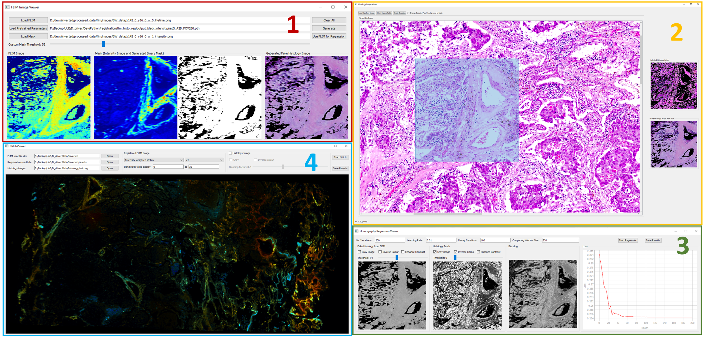
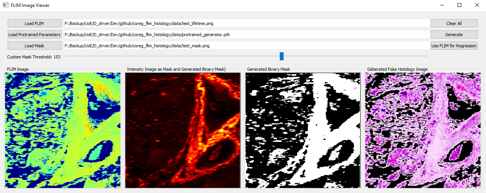
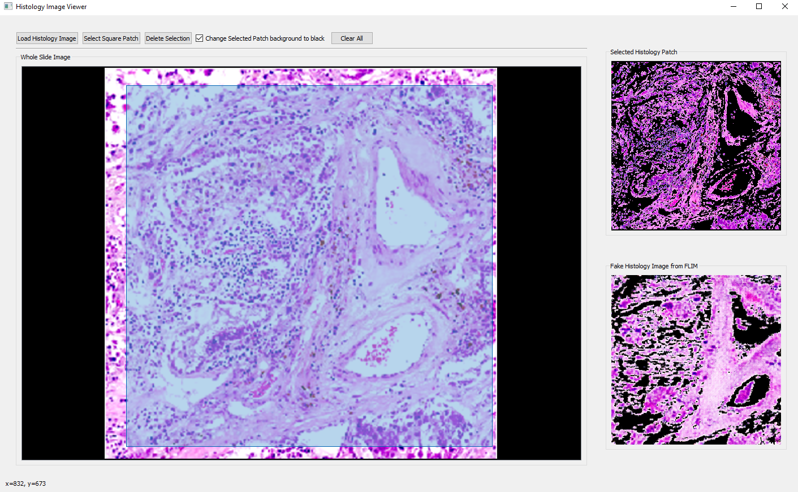
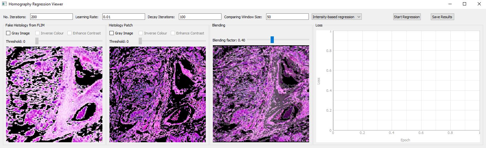
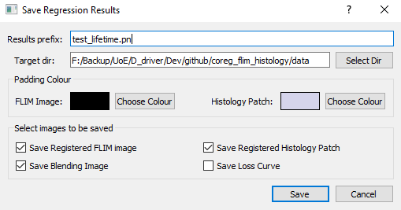
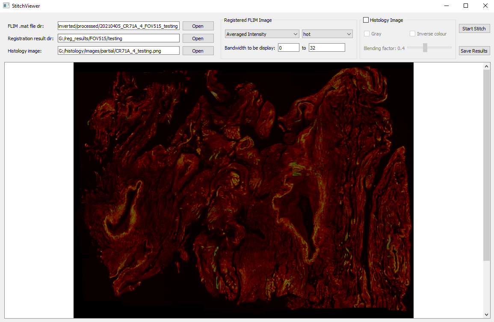

# Introduction

This software is for co-registering full-spectral label-free autofluorescence lifetime images (FS-FLIM) with histology images, in assistance with deep learning. The underlying idea is translating FLIM images to synthetic histology images which are used later for co-registration. The detailed information can be found in [our paper](https://arxiv.org/abs/2202.07755)

# Data
Demo data is provided in [./data](./data). The data used in the paper is available on the Univesrity of Edinburgh's DataShare. 
More specifically, data in figure 1, 2 (last 3 rows), 4, 6, and 7 is available [here](https://doi.org/10.7488/ds/3099). 
Data in figure 2 (first 2 rows), 3 and 5 is available [here](). 
Code for lifetime reconstruction is available [here](https://doi.org/10.7488/ds/3099). 
More specifically, the Code_Full_Spectral_FLIM.zip contains code for the principle analysis of FS-FLIM datacubes along with further code for the extraction of custom regions of interest from the analysed data. The folders contain "readme" files on how to use the code along with extensive comments in the the code itself. 

# Prerequisites
The software was developed on Windows10, but expected to run on other OS as no OS-dependent code.
To properly run this software, several Python libraries are needed:
- python tested on 3.8
- pytorch tested on 1.9.0 and 1.10.0
- pyqt tested on 5.15.2
- kornia tested on 0.5.2
- skikit-image tested on 0.17.2
- opencv tested on 4.5.1

# Get Started
## Installation
Clone this repo:
>git clone https://github.com/qiangwang57/coreg_flim_histology
> 
> cd coreg_flim_histology

## Start main GUI
- Using command
> python main.py

- Alternatively and **recommended**, open the folder with [pycharm](https://www.jetbrains.com/pycharm/), and run the main.py.

## Open FLIM image viewer

- Click the button "Open FLIM Image Viewer" to open FLIM Image Viewer as the above
- Select a FLIM image, e.g., ./data/test_lifetime.png
- Load pretrained [CycleGAN generator](https://github.com/aitorzip/PyTorch-CycleGAN). Note that this is not the official implementation. A pretrained one is at ./data/pretrained_generator.pth
- Load mask (optional) at ./data/test_mask.png, and slide "Custom Mask Threshold" for an optimal binary mask
- Click "Generate" button on the left part of the GUI to generate synthetic histology images

## Locate histology patch

- Go back to the main GUI and click "Open Histology Image" to open an histolgoy image to be registered. The synthetic histology image is displayed in the lower-right corner.
- Open an histology image, e.g., ./data/test_histo.png
- Select the patch slighly larger than the synthesised histology image. The selected area will be highlighted in sky blue
- After the selection, click "Select Square Patch" to confirm your selection. The selected patch will be displayed at the upper right. You can change the background by ticking "Change Selected Patch background to black".

## Homography regression viewer

- Go back to the main GUI and click "Open Homography Regression Viewer" to perform homography regression, where the synthetic (first) and selected histology (second) images will be displayed. The third plot is the blending of transformed synthetic and real histology images.
- Play with the parameters listed on the GUI and check the blending result for an optimal one. Using gray images is recommended for better registration results.
- Click "Start Regression" to see the result, and "Save Results" which gives a popup window for saving parameters as below:

## Stitch viewer

- Go back to the main GUI and click "Open Stitching Viewer" to stitch all tiles previously registered
- Histology image to be selected is used as the template for the stitching, which can be blended with the stiched tiles
- Spectral FLIM data loaded from .mat files is extracted at the specific bandwidth, with a custom format (averaged intensity, intensity, lifetime, or weighted lifetime) and colourmap (gray, jet, hot, or copper)

**Note**: for the data shown above, the code at line 499 and 500 in [StitchViewer.py](https://github.com/qiangwang57/coreg_flim_histology/blob/553bfc9ebc60492141fdb41e3f44d8ea562d7b6d/gui/StitchViewer.py#L499-L500) needs to be uncommented. For the data in figure 6 in the paper, [those two lines](https://github.com/qiangwang57/coreg_flim_histology/blob/553bfc9ebc60492141fdb41e3f44d8ea562d7b6d/gui/StitchViewer.py#L499-L500) need to be commented out.

# Citation
If you find this software is useful, please cite:
>Wang, Q., Fernandes, S., Williams, G.O., Finlayson, N., Akram, A.R., Dhaliwal, K., Hopgood, J.R. and Vallejo, M., 2022. Deep Learning-Assisted Co-registration of Full-Spectral Autofluorescence Lifetime Microscopic Images with H&E-Stained Histology Images. arXiv preprint arXiv:2202.07755.

# TODO
A list of things to be done to improve the software:
- [ ] Data compatibility. Currently, software is data specific for our full-spectral FLIM. This needs to be extended for general image formats.
- [ ] More registration algorithms for better results
- [ ] Integrated GUI